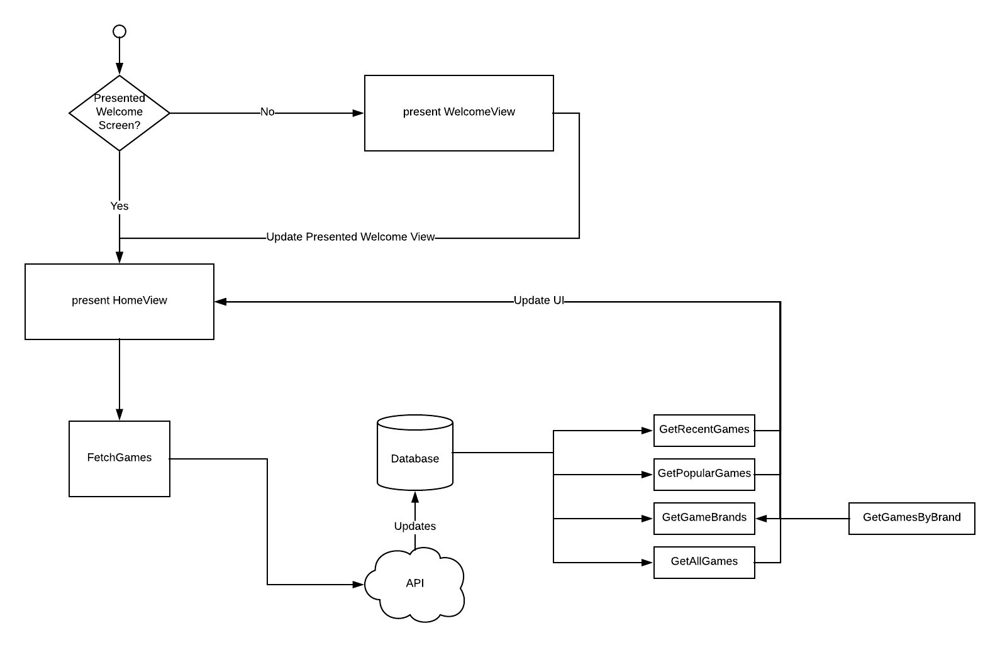

#  GameCatalog
 

This Client fetches a videogames catalog where you can see prices, newest ones and also filter them.

## App Architecture

- This Project was built with **MVVM** Architecture using **Reactive Patterns**
- In order to implement a precise layout this client uses an Dependency called **Snapkit** ([https://blog.pusher.com/mvvm-ios/]()).
- Included **Couchbase** as Persistency Manager
- Using XCTest for Unit Tests

## Dependencies (Using CocoaPods)
- **SnapKit**: Used for Programatic Layout Design (http://snapkit.io/)
- **Moya**: Used for creating a Networking layer (https://github.com/Moya/Moya])
- **Kingfisher**: Image dowloader client (https://github.com/onevcat/Kingfisher)
- **RxSwift**: Implementation of reactive patterns in app (https://github.com/ReactiveX/RxSwift)
- **Couchbase**: Used for data persistence.

## Flow Diagram

## Checklist

- [x] Design App Architecture
- [x] Create XCode Project
- [x] Install Dependencies
- [x] Organize project structure
- [x] Create & Test Models
- [x] Create Networking Layer
- [x] Create Game List Controller with Layout
- [x] (**GameList, Data Persistence**) Connect Database with View Model Controller & Test
- [x] (**GameList, Networking layer**) Connect Networking layer with Database and update once data is fetched
- [x] (**GameList**) Implement Filtering by Specific Game Brand
- [x] Create Game Details View Controller with Layout
- [x] (**GameDetails**) Connect ViewModel With Controller
- [ ] (**GameDetails, Optional**) Integrate Share Game
- [x] Create Filter Game Controller with Layout and ViewModel
- [x] (**FilterGame**) Integrate Price Range Component
- [x] (**FilterGame**) Integrate Sorting Component
- [x] (**FilterGame**) Integrate Rating Component
- [x] (**FilterGame**) Integrate Brand Component
- [x] Implement FilterGameResults Controller with Layout and ViewModel
- [x] (**FilterGameResults**) Implement Clear Filter 
- [ ] Implement Onboarding Screen Controller
- [ ] (**OnBoarding**) Integrate firstTimeOnly

