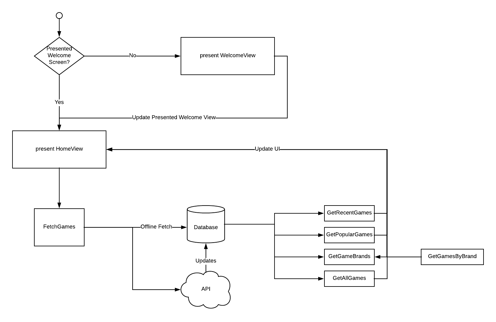

#  GameCatalog
 

This Client fetches a videogames catalog where you can see prices, newest ones and also filter them.

## App Architecture

- This Project was built with **MVVM** Architecture using **Reactive Patterns**
- In order to implement a precise layout this client uses an Dependency called **Snapkit** ([https://blog.pusher.com/mvvm-ios/]()).
- Included **CoreData** as Persistency Manager
- Using XCTest for Unit Tests

## Dependencies (Using CocoaPods)
- **SnapKit**: Used for Programatic Layout Design (http://snapkit.io/)
- **Moya**: Used for creating a Networking layer (https://github.com/Moya/Moya])
- **Kingfisher**: Image dowloader client (https://github.com/onevcat/Kingfisher)
- **RxSwift**: Implementation of reactive patterns in app (https://github.com/ReactiveX/RxSwift)

## Flow Diagram

## Checklist

- [ ] Design App Architecture
- [ ] Create XCode Project
- [ ] Install Dependencies
- [ ] Organize project structure
- [ ] Create & Test Models
- [ ] Create Networking Layer
- [ ] Create Game List Controller with Layout
- [ ] (**GameList, Data Persistence**) Connect Database with View Model Controller & Test
- [ ] (GameList, Networking layer) Connect Networking layer with Database and update once data is fetched
- [ ] (GameList) Implement Filtering by Specific Game Brand
- [ ] Create Game Details View Controller with Layout
- [ ] (GameDetails) Connect ViewModel With Controller
- [ ] (GameDetails, Optional) Integrate Share Game
- [ ] Create Filter Game Controller with Layout and ViewModel
- [ ] (FilterGame) Integrate Price Range Component
- [ ] (FilterGame) Integrate Sorting Component
- [ ] (FilterGame) Integrate Rating Component
- [ ] (FilterGame) Integrate Brand Component
- [ ] Implement FilterGameResults Controller with Layout and ViewModel
- [ ] (FilterGameResults) Implement Clear Filter 
- [ ] Implement Onboarding Screen Controller
- [ ] (OnBoarding) Integrate firstTimeOnly

